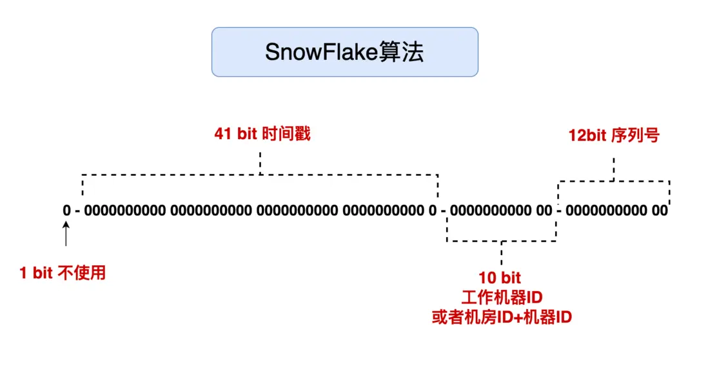

# README

雪花算法是 64 位 的二进制，一共包含了四部分：

- `1` 位是符号位，也就是最高位，始终是0，没有任何意义，因为要是唯一计算机二进制补码中就是负数，0才是正数。
- `41` 位是时间戳，具体到毫秒，41位的二进制可以使用69年，因为时间理论上永恒递增，所以根据这个排序是可以的。
- `10` 位是机器标识，可以全部用作机器ID，也可以用来标识机房ID + 机器ID，10位最多可以表示1024台机器。
- `12` 位是计数序列号，也就是同一台机器上同一时间，理论上还可以同时生成不同的ID，12位的序列号能够区分出4096个ID。

SnowFlake算法在同一毫秒内最多可以生成多少个全局唯一ID呢： 同一毫秒的ID数量 = 1024 X 4096 = 4194304

